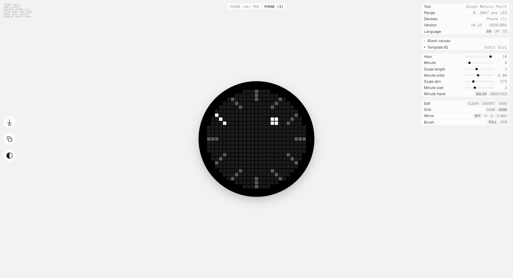

# Glyph Matrix Paint

Draw a frame for the Glyph Matrix on the back of a Nothing Phone (3) or Phone (4a) Pro, LED by
LED, in the browser, and see it laid out the way the panel lays it out.

**Open it:** [glyph-matrix-paint.vercel.app](https://glyph-matrix-paint.vercel.app). It runs in the
browser; there is nothing to install.

## The two panels

Choose the phone at the top of the page. The grid size, Glyph Touch and toy types come from the
Glyph Matrix Developer Kit's device table; the LED counts are the positions inside the panel's disc
(see How it works):

| | Grid | LEDs | Glyph Touch | Toy types |
|---|---|---|---|---|
| Phone (3) | 25 × 25 | 489 | Yes | All |
| Phone (4a) Pro | 13 × 13 | 137 | No | AOD only |

On Blank canvas each phone keeps its own drawing and its own undo, so switching between them
loses nothing. Choosing Template 01, or switching phone while it is showing, replaces that phone's
drawing with the dial; Undo brings the drawing back.

## Drawing

Choose **Blank canvas**, then click a position to light it at the brush's level. Clicking a
position that is already at that level clears it; clicking one at another level sets it to the
brush's. Drag to keep going: a drag takes its mode from the first position it touches, so it
clears if that position is already at the brush's level and lights otherwise. Positions with no
LED take no paint, as on the phone.

The control panel holds the rest (on the right in a wide window, under the disc in a narrow one):

| Row | Choices | What it does |
|---|---|---|
| Edit | Clear, Invert, Undo | Clear turns every LED off; Invert lights the dark LEDs at the brush's level and turns the lit ones off; Undo steps back through the last 64 edits on this phone |
| Grid | Show, Hide | Four guides through the centre of the panel. The vertical and horizontal ones are the axes Mirror folds about; the two diagonals mark the 45-degree lines. Only on screen; never in a download |
| Mirror | Off, H, V, 4-way | Paints the mirrored positions with each stroke: H mirrors left to right, V top to bottom, 4-way both |
| Brush | Full, Dim | Full is the brightest level the page draws; Dim is a lower one, for quiet marks |

The keyboard has the usual undo and redo: Cmd+Z or Ctrl+Z steps back, Shift+Cmd+Z, Ctrl+Shift+Z
or Ctrl+Y steps forward, and a new edit clears what redo could bring back.

## Template 01: Orbit Dial

**Template 01** draws [Orbit Dial](https://github.com/samkex/orbit-dial), an always-on clock toy:
twelve hour scales with the current one lit, and a minute mark that orbits inside them.

Choosing it moves to the Phone (3) and draws the dial in place of the drawing on screen. Hour and
Minute start at 10:08; the other sliders start at the values the toy ships with on the phone shown,
and switching phone loads that phone's.

| Control | Range | Phone (4a) Pro | Phone (3) |
|---|---|---|---|
| Hour | 0 to 11 | 10 | 10 |
| Minute | 0 to 59 | 8 | 8 |
| Scale length | 1 to 6 LEDs | 2 | 3 |
| Minute orbit | 1 to 12, in halves | 1.5 | 6.0 |
| Scale dim | 0 to 2047 | 575 | 575 |
| Minute size | 1 to 4 | 2 | 2 |

**Minute hand** chooses between **Solid**, a block of whole LEDs whose side is Minute size, and
**Smoothed**, which spreads the minute over the nearest cells by weight so its centre of light moves
every minute (Minute size does not apply to it).

Painting, Clear and Invert switch to Blank canvas first and act on what the template drew:
painting adds to the dial, Invert flips it, Clear empties it. Undo also switches to Blank canvas,
and its first step brings back the drawing the template replaced. So you can start from the dial
and move single LEDs by hand, or go back to what you had.

## Taking a frame out

The rail (on the left in a wide window) has **Download SVG** and **Copy PNG**:

- **Download SVG** saves the panel as drawn, 520 × 520: a black disc and one square per LED.
- **Copy PNG** puts the same picture on the clipboard at 1040 × 1040, to paste into a document.

Neither carries the Grid guides.

## How it works

**One array per phone.** Everything on a panel comes from a single array with one value per
position. Drawing edits it; the template refills it from its sliders; a download writes it out.
Switching from the template to Blank canvas keeps the array as it is, which is why a drawing can
start from the dial.

**The panel is a disc.** On both phones the positions with an LED are exactly those within half the
grid's width of its centre: 489 of 625 on the Phone (3), 137 of 169 on the Phone (4a) Pro. The page
draws only those, so a frame here never lights a position the phone does not have.

**Brightness runs to 2047.** Orbit Dial's README reports 0 to 2047 per LED for a Glyph Matrix
frame, a wider range than the 0 to 255 the kit documents for `GlyphMatrixObject`, and how it was
measured. The page draws in 0 to 255, and Scale dim is in the panel's own units.

**A screen is not the panel.** An LED near the bottom of its range does not respond like a pixel.
Orbit Dial's Scale dim, 575 (28 per cent of 2047), was read on the LEDs rather than computed. Use
the page to compose and compare; treat a brightness chosen here as a starting point.

**The preview.** The panel is drawn as one square per LED on a black disc, at the panel's own LED
count rather than as a smoothed image, so the steps a curve takes here are the steps it takes on the
phone.

## Languages and themes

English, Japanese and Traditional Chinese (Hong Kong), chosen in the panel. The page opens in light;
the button on the rail switches between light and dark.

## Measured on

The brightness range was read on a Phone (4a) Pro on Nothing OS C5.0-260902-1559 (Glyph service
3.6.0). On a Phone (3) on Nothing OS C5.0-260921-0124 (Glyph service 5.0.0), Orbit Dial's README
reports that the panel takes the full range. Both against the Glyph Matrix Developer Kit at commit
`999b1143`.

## Licence

Copyright © 2026 Keith Chan. All rights reserved. The page is free to use; its design, code, text
and images are not licensed for reuse. The page's icons are Nothing's and are not covered by this
notice. See [LICENSE](LICENSE).

The page embeds the Geist and Geist Mono typefaces, which are under the SIL Open Font License 1.1;
the licence travels inside the page.

## Acknowledgements

The device table and the Glyph Matrix API come from Nothing's
[Glyph Matrix Developer Kit](https://github.com/Nothing-Developer-Programme/GlyphMatrix-Developer-Kit).
